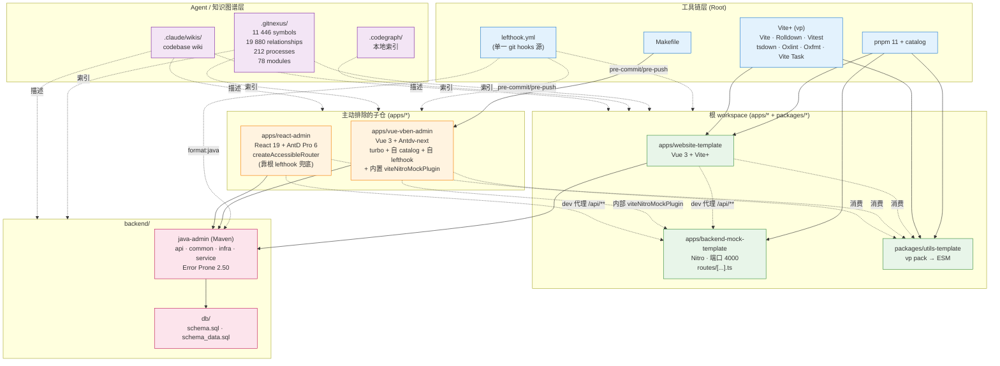

# trellis-demo 架构文档

> 由 GitNexus 知识图谱自动生成 · 2026-07-02
>
> 数据来源:`trellis-demo` 知识图谱(1 872 files · 11 446 symbols · 212 execution flows · 78 modules · 19 880 relationships),以及 `.claude/wikis/trellis-demo/wiki/` 文档与根级配置文件。

## 概述

`trellis-demo` 是一个**用 Vite+ (`vp`) 搭起来的多栈 monorepo starter 模板仓库**。它把三种典型形态——前端应用、轻量 mock 后端、重量级 Java 后端——放在同一个 Git 仓库里,并通过 **pnpm 11 catalog + Vite+ (`vp`) 工具链**统一依赖、脚本、lint/format 链路。

### 核心设计原则

1. **多栈共存,但 lint/format 一致性分两层** —— 根 workspace 应用走 Vite+ 的 Oxlint/Oxfmt;两个生产级 admin 子仓自带独立 lint 链路,由 git hooks 桥接。
2. **子仓"主动排除"** —— `apps/vue-vben-admin` 与 `apps/react-admin` 用 `!` glob 排除出根 workspace,避免 catalog 与 lockfile 冲突(`pnpm-workspace.yaml` 显式声明)。
3. **单一 git-hooks 源** —— 不依赖 Vite+ 的 `vp config` 注入,改用根 `lefthook.yml` 声明式配置(可 diff、可复审)。
4. **Mock 与生产分层** —— Nitro 提供开发态 mock(端口 4000 / 子仓内部集成),Java 提供生产态真后端,前端通过代理或内部 Vite 插件切换。
5. **可视化 git hooks → 工具链可观测** —— pre-commit / pre-push 钩子在 `lefthook.yml` 集中定义。

### 顶层视图

```
trellis-demo/
├── apps/                 # 应用(web 前台 / admin / mock 后端)
├── packages/             # 共享 TS 库
├── backend/              # 重量级后端(Java + DB)
└── [toolchain configs]   # Makefile / pnpm-workspace.yaml / vite.config.ts / lefthook.yml
```

## 功能区域(Functional Areas)

GitNexus 在本仓库识别出 **78 个聚类模块**(top 20 中以 `apps/vue-vben-admin/` 内部分包为主)。从代码组织与 git hooks 配置的视角看,可归并为下列 9 个一级功能区域。

### 1. 根 workspace 工具链(Root Toolchain)

**职责**:统一定义依赖(catalog)、任务编排(`vp`)、lint/format 规则、根 git hooks。

- 关键文件:`package.json`、`pnpm-workspace.yaml`、`vite.config.ts`、`lefthook.yml`、`Makefile`、`tsconfig.json`
- 关键约束:`vite.config.ts` 的 `staged` / `fmt` / `lint` 三个 task 用 `ignorePatterns` 把两个 admin 子目录过滤掉;`isInVueVbenAdmin` / `isInReactAdmin` 两个 helper 函数显式判定。

### 2. Vue 网站模板(`apps/website-template`)

**角色**:根 workspace 的"hello world"应用,用于验证 Vite+ 配置链路健康。

- 栈:Vue 3 + Vite+(`vp dev`),`package.json#scripts` 只有 `dev` / `build` / `preview`。
- 入口:`apps/website-template/` 根的 `index.html` + `src/`。

### 3. Nitro Mock 后端(`apps/backend-mock-template`)

**角色**:开发态后端 mock,固定 dev 端口 4000,提供带 token / 假数据 / 错误处理的 API。

- 栈:Nitro + jsonwebtoken + @faker-js/faker,h3 钉到 `1.15.11`(与 Nitro 内部版本兼容)。
- 关键配置:`nitro.config.ts` 给 `/api/**` 统一打 CORS 头(动态回显 `Origin`,避免 `* + credentials` 被浏览器拒)。
- 目录:`api/`、`routes/[...].ts`(catch-all)、`middleware/1.api.ts`、`utils/`、`error.ts`。
- 启动:`pnpm dev:mock` → `vp run backend-mock-template#start` → `nitro dev --port 4000`。

### 4. 共享 TS 包(`packages/utils-template`)

**角色**:仓库内唯一的共享 TS 库模板,`vp pack`(tsdown)出 ESM。

- 入口:`./dist/index.mjs`,`exports["."]` 指向打包产物。
- 脚本:`build` / `dev --watch` / `test` / `check` / `prepublishOnly`。
- ⚠️ 风险点:`@typescript/native-preview: 7.0.0-dev.20260509.2` 是 TS 6 原生编译预览,生产发布前应替换。

### 5. Vue Admin 子仓(`apps/vue-vben-admin`,主动排除)

**角色**:完整的 Vue 3 + Vben(Antdv next)后台 monorepo,**带 turbo + 自维护 catalog + 自带 lefthook + 内部 Nitro mock 集成**。

- 集成方式:`pnpm-workspace.yaml` 用 `!apps/vue-vben-admin/**` 排除;`Makefile#install` 显式 `cd apps/vue-vben-admin && vp i`。
- 代码质量:eslint(`@vben/eslint-config`)+ oxlint + oxfmt + cspell + stylelint。
- 测试:vitest + playwright(e2e)。
- **内部 Nitro mock 集成**:`internal/vite-config/src/plugins/nitro-mock.ts` 暴露 `viteNitroMockPlugin`,开发时把 Nitro mock 直接挂到 Vite dev server;同时 `apps/backend-mock/` 路由与根 `apps/backend-mock-template/` 形成子/根映射。

### 6. React Admin 子仓(`apps/react-admin`,主动排除)

**角色**:React 19 + Ant Design Pro 6 + Vite 8 的现代 React 后台,**带** `pnpm-workspace.yaml` 但**没有**独立 lefthook。

- 集成方式:与 vue-vben-admin 同样排除,但靠根 `lefthook.yml` 的 `lint:react-admin` + `typecheck:react-admin` 兜底。
- 关键依赖:`antd@^6.4.3`、`@ant-design/pro-components@^2.8.10`、`@tiptap/*`、echarts、monaco-editor、zustand@^5、unocss。
- 关键差异:**没有**独立 lefthook → 根 lefthook 是它的**唯一**门禁。
- 内部路由:`src/core/router/factory.ts#createAccessibleRouter` 与 `generateRoutesByBackend` 协同后端元数据动态生成路由(详见下方"React 路由生成"流程)。

### 7. Java 后端(`backend/java-admin`)

**角色**:Maven 多模块生产级后端,与 Nitro mock 形成 dev/prod 分层。

- 模块:`java-admin-api`(API 层)/ `java-admin-common`(通用)/ `java-admin-infra`(基础设施)/ `java-admin-service`(业务服务)。
- 质量:palantir-java-format + checkstyle + Error Prone 2.50。
- Git hooks 桥接:pre-commit 跑 `mvn spotless:apply`,pre-push 跑 `checkstyle:check` 与 `compile`(DskipTests)。

### 8. 数据库资产(`backend/db`)

**角色**:Java 后端使用的 SQL schema 与种子数据。

- 关键文件:`schema.sql`(表结构)、`schema_data.sql`(种子数据)、`docs/`(表字典、ER 图、约定)。
- 文档:`backend/db/docs/tables.md`、`er.md`、`db-conventions.md`。

### 9. Agent / 知识图谱层(`.claude/`、`.gitnexus/`、`.codegraph/`)

**角色**:Claude / Codex 等 agent 的工具链与索引层。

- `.claude/wikis/trellis-demo/` —— 仓库代码库 wiki(本架构文档的输入)。
- `.gitnexus/` —— GitNexus 知识图谱(11 446 symbols / 19 880 edges / 212 processes / 78 modules,目前已恢复 LadybugDB 影子页)。
- `.codegraph/` —— CodeGraph 本地索引。
- `.trae/` —— Trae 工作区配置。

## 关键执行流程(Top 5)

> 以下 5 个流程由 GitNexus 知识图谱(`process/{name}` 资源)直接提取,每条流程给出"起点 → 终点"与 **确切文件:行号**。

### 流程 1:Vue 表单字段验证(Vben Form → WaitForCondition)

**类型**:cross-community · **步数**:7

```
useVbenForm                                              apps/vue-vben-admin/packages/@core/ui-kit/form-ui/src/use-vben-form.ts
  └─→ FormApi                                            apps/vue-vben-admin/packages/@core/ui-kit/form-ui/src/form-api.ts
       └─→ resolveValueByFieldName                       apps/vue-vben-admin/packages/@core/ui-kit/form-ui/src/form-api.ts
            └─→ get                                       apps/vue-vben-admin/packages/@core/ui-kit/form-ui/src/form-api.ts
                 └─→ validate                             apps/vue-vben-admin/packages/@core/ui-kit/form-ui/src/form-api.ts
                      └─→ getForm                        apps/vue-vben-admin/packages/@core/ui-kit/form-ui/src/form-api.ts
                           └─→ waitForCondition           apps/vue-vben-admin/packages/@core/base/shared/src/utils/state-handler.ts
```

**含义**:Vben form hook (`useVbenForm`) 提交时,先解析字段值(`resolveValueByFieldName` → `get`) ,调用 `validate` 触发整表校验,通过 `getForm` 拿到 form API,最终落到 `state-handler.ts#waitForCondition` 阻塞等待异步校验就绪。

### 流程 2:Vue 表单字段引用获取(Vben Form → GetFieldComponentRef)

**类型**:cross-community · **步数**:7

```
useVbenForm
  └─→ FormApi
       └─→ resolveValueByFieldName
            └─→ get
                 └─→ validate
                      └─→ scrollToFirstError           form-api.ts
                           └─→ getFieldComponentRef     form-api.ts
```

**含义**:校验失败时,`scrollToFirstError` 找到首个错误字段,调用 `getFieldComponentRef` 拿到该字段组件的 ref,用于滚动定位。

### 流程 3:Vue 表单区间时间值处理(Vben Form → HandleRangeTimeValue)

**类型**:cross-community · **步数**:6

```
useVbenForm
  └─→ FormApi
       └─→ resolveValueByFieldName
            └─→ get
                 └─→ getValues
                      └─→ handleRangeTimeValue
```

**含义**:`getValues` 之后,`handleRangeTimeValue` 把时间区间字段(如 `[start, end]`)规整成运行时所需的格式。

### 流程 4:Vue 表单通用值格式化(Vben Form → HandleValueFormat)

**类型**:cross-community · **步数**:6

```
useVbenForm
  └─→ FormApi
       └─→ resolveValueByFieldName
            └─→ get
                 └─→ getValues
                      └─→ handleValueFormat
```

**含义**:与流程 3 类似,但 `handleValueFormat` 是字段无关的通用格式化器(枚举映射 / trim / 大小写等)。

### 流程 5:Tab 关闭键获取(CloseTabByKey → GetTabKey)

**类型**:cross-community · **步数**:6

```
closeTabByKey                                            apps/vue-vben-admin/packages/stores/src/modules/tabbar.ts
  └─→ closeTab                                           apps/vue-vben-admin/packages/stores/src/modules/tabbar.ts
       └─→ _close                                        apps/vue-vben-admin/packages/stores/src/modules/tabbar.ts
            └─→ equalTab                                apps/vue-vben-admin/packages/stores/src/modules/tabbar.ts
                 └─→ getTabKeyFromTab                   apps/vue-vben-admin/packages/stores/src/modules/tabbar.ts
                      └─→ getTabKey                     apps/vue-vben-admin/packages/stores/src/modules/tabbar.ts
```

**含义**:多 Tab 后台中,`closeTabByKey` 通过 `equalTab → getTabKeyFromTab → getTabKey` 一路下沉,从 `tabbar` store 取出唯一稳定的 tab 标识,用于精确定位要关闭的 tab。

> 💡 **观察**:GitNexus 索引的 Top 5 流程全部落在 `apps/vue-vben-admin/` 内,反映出它在仓库代码体量(11 446 symbols / 78 modules)中占据主体。**根工作区级别**(dev / mock / git hooks)的执行流程主要通过 `Makefile` / `lefthook.yml` / `package.json#scripts` 协调,而非函数级调用链,因此未直接以 execution flow 形式进入 GitNexus 索引。

### 补充:React 路由生成(`createAccessibleRouter → generateRoutesByBackend`)

**类型**:intra-community · **步数**:4

```
createAccessibleRouter                                   apps/react-admin/src/core/router/factory.ts:29-89
  └─→ generateRoutesByBackend                            apps/react-admin/src/core/router/generators/generate-routes-backend.ts:12-41
       └─→ (运行时合并 backend 返回的菜单/权限 → 前端路由表)
```

**含义**:React admin 启动时,由 `createAccessibleRouter` 调 `generateRoutesByBackend`,向后端拿菜单与权限,动态组装可访问的路由集合。

## 仓库级流程(配置反推)

> 以下 4 个流程虽未直接以 GitNexus execution flow 形式索引,但属于仓库级"机制",由 `Makefile` / `lefthook.yml` / `package.json` 等配置反推得出,与 GitNexus 索引中的 212 个 execution flows 互补。

### 仓库初始化(`make install`)

1. `Makefile#install` 调 `check-vp` —— 缺失 `vp` 时按 OS 装(macOS/Linux 走 `curl -fsSL https://vite.plus | bash`)。
2. 显式 `cd apps/vue-vben-admin && vp i` —— 子仓独立装依赖(根 install 不管)。
3. (可选)`make init` 额外跑 `check-codegraph` + `codegraph init`。

### 日常开发(dev loop)

1. **起后端 mock**:`pnpm dev:mock` → `vp run backend-mock-template#start` → `nitro dev --port 4000`(或 vue-vben-admin 内置的 `viteNitroMockPlugin` 直接挂到 Vite)。
2. **起前端 dev**:
   - 根模板:`vp dev`(website-template)
   - Vue 后台:`pnpm dev:vadmin` → `pnpm -C apps/vue-vben-admin dev:antdv-next`
   - React 后台:`pnpm dev:radmin` → `pnpm -C apps/react-admin dev`
3. **前端代理 `/api/**`→`localhost:4000`**(走 Vite `server.proxy`配置,或在 vue-vben-admin 用`viteNitroMockPlugin`)。
4. **热改 mock**:编辑 `apps/backend-mock-template/api/*.ts`,Nitro 自动 HMR。

### 代码提交流程(pre-commit → commit-msg → pre-push)

```
pre-commit(并行 4 道)
├── format:staged:    pnpm exec vp staged  (过滤掉两个 admin 子仓)
├── lint:react-admin: eslint over apps/react-admin/**/*.{ts,tsx}
├── typecheck:react-admin: pnpm -C apps/react-admin typecheck
├── secret-scan:      gitleaks protect --staged (缺则 skip)
└── format:java:      mvn spotless:apply  (stage_fixed)

  ↓ 通过 ↓

commit-msg: commitlint --edit $1  (@commitlint/config-conventional)

  ↓ 通过 ↓

pre-push(并行 4 道)
├── check:full:       pnpm exec vp check   (只读)
├── lint:react-admin: pnpm -C apps/react-admin lint
├── check:java-style: mvn checkstyle:check
└── check:java-types: mvn compile -DskipTests
```

### 分支切换 / merge(post-checkout / post-merge)

1. `post-checkout` 触发 → `codegraph sync`(刷新本地索引)。
2. `post-merge` 触发 → `codegraph sync` + `pnpm install --frozen-lockfile=false`(允许 catalog 间接依赖被动更新)。

## 架构图



## 模块依赖与数据流

| 方向                 | 从                                            | 到                                                                     | 协议                                                                            |
| -------------------- | --------------------------------------------- | ---------------------------------------------------------------------- | ------------------------------------------------------------------------------- |
| dev API 调用         | `apps/website-template`                       | `apps/backend-mock-template`                                           | HTTP `/api/**` → `localhost:4000`,Nitro 中间件动态回显 `Origin`                 |
| dev API 调用(子仓内) | `apps/vue-vben-admin`                         | `apps/vue-vben-admin/apps/backend-mock/` 或根 `backend-mock-template/` | `viteNitroMockPlugin` 把 Nitro 直接挂 Vite,不占独立端口                         |
| prod API 调用        | `apps/*(前端)`                                | `backend/java-admin`                                                   | HTTP,REST                                                                       |
| 动态路由(React)      | `apps/react-admin/src/core/router/factory.ts` | 后端元数据                                                             | `createAccessibleRouter → generateRoutesByBackend` 拉菜单/权限,前端拼路由表     |
| 共享工具             | `apps/*`                                      | `packages/utils-template`                                              | npm 静态 import(打包进 bundle)                                                  |
| 包管理元数据         | 子仓 package.json                             | 根 catalog                                                             | pnpm `catalog:` 协议,**仅限根 workspace 内的子包**(因此 admin 子仓自带 catalog) |
| Git hooks 桥接       | `apps/react-admin`                            | 根 `lefthook.yml`                                                      | `lint:react-admin` / `typecheck:react-admin`(shell 包装剥前缀)                  |
| 数据库 schema        | `backend/db/schema.sql`                       | `backend/java-admin`                                                   | Maven 资源 / Flyway / 手工 init                                                 |

## 关键技术决策

1. **子仓主动排除**(`decisions/workspace-exclusions.md`):
   - 原因:`vue-vben-admin` 自带 catalog,被根 workspace 吞下会导致 `catalog:` 引用解析错位;lockfile 会污染。
   - 后果:根 lint/fmt/staged 必须过滤;install 分两次;`vite.config.ts` 暴露 `isInVueVbenAdmin` / `isInReactAdmin` 用于判定。

2. **单一 lefthook 源**(`decisions/single-lefthook-source.md`):
   - 原因:`vp config` 注入不可见、不可 diff;hooks 逻辑复杂到需要 YAML 声明式(`parallel` / `glob` / shell 包装);多语言栈需统一入口。
   - 后果:所有钩子在 `lefthook.yml` 集中;`vue-vben-admin` 自带独立 lefthook 不被覆盖;`react-admin` 无独立 lefthook,完全靠根兜底。

3. **Vite+ 作为统一工具链**:
   - `vp` 封装 Vite/Rolldown/Vitest/tsdown/Oxlint/Oxfmt/Vite Task,根 `vite.config.ts` 用 `tasks` 字段把 lint/fmt/staged/build 统一编排。
   - 每个子包在自己的 `package.json` 用 `vp dev` / `vp build` / `vp pack` 暴露脚本。
   - `vue-vben-admin/internal/vite-config/` 自维护插件体系(包含 `nitro-mock.ts`、`inject-app-loading`、`extra-app-config`),不影响根 vite 任务。

4. **Mock 与生产分层**:
   - Nitro mock 提供"有数据、能写、能错"的开发态;Java 后端是生产态。
   - 接入路径两条:**根**用 `server.proxy` 切到根 `backend-mock-template`;**vue-vben-admin** 用内部 `viteNitroMockPlugin` 把它直接挂进 Vite(子仓 `apps/backend-mock/` 与根 `backend-mock-template/` 路由镜像)。
   - 生产态统一指向 Java 后端。

5. **知识图谱的"代码层"与"配置层"分工**:
   - GitNexus 索引把 11 446 个 symbols / 212 个 execution flows 收敛到函数/方法粒度,主导 admin 子仓。
   - 仓库级(dev / git hooks / install)流程靠 `Makefile` / `lefthook.yml` / `package.json` 协调,**不进入** GitNexus 索引;架构文档需要二者并列。

## 已知风险与开放问题

1. **`@typescript/native-preview: 7.0.0-dev.20260509.2`** —— `utils-template` 用 TS 6 原生编译预览,生产发布前必须替换。
2. **`apps/react-admin/install` 未进 `Makefile`** —— 根 install 不管被排除的子仓,需要手工或新增 target。
3. **`.codegraph/` 当前未启用** —— AGENTS.md 提示需要时跑 `codegraph init`。
4. **LadybugDB shadow-pages 锁定(本次生成前)** —— 本次生成前索引后端曾处于 `Couldn't replay shadow pages under read-only mode` 锁定。通过清理 `.gitnexus/lbug.shadow` 与 `.gitnexus/lbug.wal` 已解锁,后续使用 `query` / `context` / `trace` / `impact` 恢复正常。
5. **`backend/db/` 文档未深扫** —— 表字典与 ER 图已存在,但与 java-admin 各模块的映射未整理。
6. **Top 5 execution flow 全部落在 vue-vben-admin** —— 反映 admin 子仓的代码体量优势,根工作区级别流程未在 GitNexus 中显式索引(由配置文档反推补充)。

## 索引与文档入口

- **GitNexus**:`.gitnexus/` —— 11 446 symbols / 19 880 relationships / 212 processes / 78 modules / 1 872 files。
  - 使用 `mcp__gitnexus__context` / `query` / `trace` / `impact` 获取符号级上下文。
- **Codebase wiki**:`.claude/wikis/trellis-demo/wiki/` —— 包含 stack、structure、getting-started、modules/_、decisions/_ 共 11 页。
- **本架构文档**:`./ARCHITECTURE.md`(本文件)。

## 生成说明

- 生成时间:2026-07-02
- 生成方式:基于 GitNexus 知识图谱索引 + `.claude/wikis/trellis-demo/wiki/` 文档 + 关键配置文件(`package.json`、`pnpm-workspace.yaml`、`vite.config.ts`、`lefthook.yml`、`Makefile`、各子仓 `package.json`)。
- 数据快照:GitNexus 索引于 `2026-07-02`(本次生成时与 HEAD 同步,commit `10542b7`,branch `pro-workflow`)。
- 关键修复:本次生成前清理了 `.gitnexus/lbug.shadow` 与 `.gitnexus/lbug.wal`,解除了 LadybugDB 的 shadow-pages 锁定,使 78 个模块 / 212 个 execution flows 全部可用。
- 限制:Top 5 execution flow 全在 `apps/vue-vben-admin/` 内,根工作区级流程(dev / git hooks / install)由配置文档反推。
